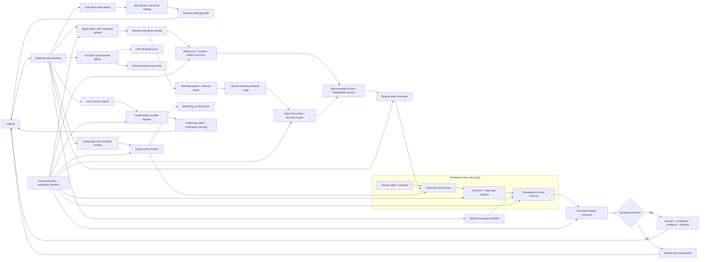

# Threadline — Stories Behind the Music

> **Working-title applied AI draft:** explore music as a connected, source-backed human story.

Threadline transforms an artist catalog from a list of releases into an explorable universe of people, groups, eras, albums, songs, public statements, and sources. A listener can freely browse, follow an optional chronological story, cross into a related artist's universe, or ask the reviewed archive a natural-language question.

The reviewed story archive is deliberately small, while the synchronized music catalog now covers Tyler, the Creator, Odd Future, and the collective's documented members and subgroups. This keeps editorial claims narrow without making the discography experience feel like a static demo.

## Evolution From the Base Project

This project extends the Module 3 **Music Recommender Simulation**. The original system ranked 10 fictional songs using fixed genre, mood, energy, and acousticness weights. It answered only: "Which songs in this tiny catalog match four preferences?"

Threadline keeps music discovery and transparent decision-making, but redesigns the output around a deeper problem:

> Music platforms show what an artist released, while the context connecting artists, events, albums, interviews, and songs remains scattered and easy to misrepresent.

The original recommender remains in `src/recommender.py` as a reproducible baseline. The applied system turns that requirement into a useful entrance: it recommends a track from the listener's own Apple Music library, explains the score, and then opens the artist's story universe. Reviewed retrieval, claim labels, abstention, cross-universe navigation, and a separate live-concert boundary extend that journey.

## What the Draft Does

- Searches a general catalog of reviewed artist, group, and collective universes.
- Imports an Apple Music library or playlist XML export without storing it in the project.
- Recommends real library tracks in Rediscover, Comfort, or Deep Cut modes and exposes every scoring signal.
- Continues a selected playlist with listening-based candidates, mood/category matching, multi-seed support, and diversity reranking.
- Turns a recommendation into an artist-story entrance instead of ending at a ranked list.
- Opens on a real homepage with free-form search for any MusicBrainz artist identity.
- Gives unreviewed artists a catalog profile instead of hiding them from search.
- Presents optional chronological stories while preserving free exploration.
- Shows Tyler's complete album/mixtape chapter set as visible cards rather than a dropdown.
- Indexes all 139 tracks in Tyler's nine album chapters, including The Estate Sale and CHROMAKOPIA+ additions.
- Adds Odd Future's three core group projects and the 12 Odd Future Songs compilation, totaling 67 collective-catalog tracks.
- Adds synchronized local catalogs for 20 Odd Future members/subgroups: 127 releases and 1,431 tracks, with 780 direct YouTube Music/artist-channel destinations.
- Treats albums as clickable chapters with a sourced "before the album" context layer.
- Separates shared album background from song-specific background on every song page.
- Reuses the reviewed album layer when no public source discusses an exact song, while labeling that fallback instead of inventing a unique motive.
- Places collaborator connections inside album chapters and links each person to their universe.
- Opens every displayed track on a dedicated song page with credits and sources.
- Embeds reviewed official YouTube videos at the top of song pages without downloading them.
- Loads synchronized or plain lyrics on demand from LRCLIB and drives progressive karaoke highlighting when timestamps are available.
- Keeps lyrics out of the static archive, attributes the LRCLIB record, and retains Genius as a fallback destination.
- Connects artists across groups, collaborators, and adjacent universes.
- Answers questions using only retrieved passages from the reviewed archive.
- Separates documented facts, artist statements, reporting, criticism, and fan theory.
- Refuses to infer private psychological states or unsupported direct causation.
- Loads upcoming concerts automatically, orders the nearest dates first, and links to ticket details.
- Exposes confidence, evidence passages, citations, freshness, and limitations.

## Personal Apple Music Recommendation

Open **My library** in the sidebar, then provide an XML export from Music on a
Mac. Apple documents **File → Library → Export Library** for the full library or
**Export Playlist** for one playlist. The export contains item information, not
the audio itself. See [Apple's export instructions](https://support.apple.com/en-ie/guide/music/-mus27cd5060f/mac).

For a stakeholder walkthrough, choose **Launch the live demo** instead. It loads
a clearly labeled six-track public sample playlist and runs the same profiling,
playlist-continuation, hybrid-ranking, explanation, and story-navigation code
without requiring anyone to reveal personal listening history.

Threadline discards paths, account fields, comments, and unrelated plist data.
It keeps only title, artist, album, genre, play count, skip count, rating, and
library dates in the running session. A local Streamlit run keeps processing on
the listener's computer; a hosted deployment processes the upload on that host.

The recommender does not invent mood, energy, or audio features that Apple did
not export. Instead, it publishes three deterministic recipes:

| Mode | Strongest signals |
|---|---|
| Rediscover | Time since the recorded play, genre affinity, and positive history |
| Comfort pick | Familiarity, genre affinity, rating, and positive history |
| Deep cut | Low play count, genre affinity, time away, and positive history |

Each result includes a normalized score, plain-language reasons, the underlying
signal values, and a button that opens the artist's reviewed story or universal
MusicBrainz catalog profile.

## Researched Playlist-Continuation System

The playlist feature uses a **two-stage hybrid**, not a single artist-to-artist
rule. Spotify's RecSys Challenge defined automatic playlist continuation as
recommending tracks that fit an existing playlist and evaluated systems against
one million user-created playlists. A published challenge system combined
matrix factorization, playlist-title and audio features, and track co-occurrence
through ranking fusion. Those results support combining behavioral and content
signals instead of trusting one proxy.

- [Spotify Research: Automatic Music Playlist Continuation](https://research.atspotify.com/publications/recsys-challenge-2018-automatic-music-playlist-continuation)
- [Ferraro et al.: Hybrid recommender combining text, audio, and co-occurrence](https://arxiv.org/abs/1901.00450)

Threadline implements the signals that are realistically available to this
prototype:

1. Choose up to six seed tracks while preferring different artists.
2. Generate candidates with Last.fm's `track.getSimilar`, which is explicitly
   based on listening data.
3. Build the playlist's category profile from its name and community track tags.
4. Remove tracks already present and score the rest.
5. Rerank to avoid returning several tracks by the same artist.

The final score is transparent:

| Signal | Weight |
|---|---:|
| Listening-data track similarity | 40% |
| Mood/category tag fit | 25% |
| Support from multiple playlist seeds | 15% |
| Affinity visible in the listener's library | 10% |
| Discovery value | 10% |

Last.fm exposes a similarity score, not raw fan-overlap counts. Threadline
therefore says that listening data connects two tracks; it never invents a
claim such as “72% of this artist's fans also like that artist.” Community tags
come from `track.getTopTags` and can be noisy, so they remain one signal rather
than a hard mood label.

- [Last.fm listening-based similar tracks](https://www.last.fm/api/show/track.getSimilar)
- [Last.fm community track tags](https://www.last.fm/api/show/track.getTopTags)

Configure the candidate provider before launching the app:

```bash
export LASTFM_API_KEY="your-key"
streamlit run app.py
```

The public Last.fm methods require an API key but do not require a listener
login. When the user requests matches, Threadline sends representative
artist/title pairs and shortlisted candidate names for similarity/tag lookup;
the complete Apple library export stays in the running Threadline session.

Apple also offers personal recommendations and a playlist-write endpoint, but
both require a Music User Token. They are a later integration: the current XML
version recommends and links to Apple Music without changing the user's account.

- [Apple default personal recommendations](https://developer.apple.com/documentation/applemusicapi/get-all-recommendations)
- [Apple add-tracks-to-playlist endpoint](https://developer.apple.com/documentation/applemusicapi/add-tracks-to-a-library-playlist)

## AI Feature: Grounded Retrieval and Answering

`ArchiveRepository` validates the static archive and uses a transparent TF-IDF-style ranker. Title, entity, tag, and passage matches receive different weights, and term rarity plus query coverage affect relevance. `GroundedAnswerEngine` then composes an extractive response from the highest-confidence reviewed passages.

This is intentionally **extractive rather than open-ended generative RAG**. It provides a reproducible, no-API-key baseline and prevents a language model from inventing music history. The retrieval component meaningfully changes the answer: unsupported questions abstain, critical interpretations are excluded unless the user opts in, and every answered claim carries its evidence trail.

## Trust and Claim Labels

| Label | Meaning |
|---|---|
| `documented-fact` | Directly observable or recorded event supported by a source |
| `artist-stated` | The artist or collaborator said it publicly |
| `reported` | A publication reported or synthesized it |
| `critical-interpretation` | A critic's reading, available only when enabled |
| `fan-theory` | Unconfirmed community theory, always optional and labeled |

The archive may describe what an artist publicly said, made, or experienced. It may not claim access to a private psychological state. Sequence and influence are not presented as direct causation without explicit supporting evidence.

## Architecture

The editable Mermaid source is [`diagrams/architecture.mmd`](diagrams/architecture.mmd).



## Design Decisions

- **Extractive Grounded Retrieval over Open Generative RAG**: To eliminate hallucinations in music history, Threadline tokenizes and scores reviewed passages using transparent TF-IDF retrieval, composing answers strictly from cited passages.
- **Explicit Claim-Type Taxonomy**: Every archived passage is categorized (`documented-fact`, `artist-stated`, `reported`, `critical-interpretation`, `fan-theory`), enforcing boundaries so speculation is never presented as factual biography.
- **Session-Only Apple Music Profile**: Personal library XML exports are processed entirely in session memory without disk persistence or audio upload, preserving privacy while enabling transparent recommendation scoring.
- **Separation of Static Archive and Live Data**: Historical story narratives are static and editorially reviewed, whereas volatile data (live Ticketmaster concerts, LRCLIB lyrics) are handled by decoupled external adapters with freshness and verification warnings.
- **Album Era Background with Song Layer Abstention**: When song-specific context is unindexed, song pages reuse reviewed album context rather than fabricating single-track motives, explicitly marking the fallback boundary.

## Setup

Python 3.10–3.13 is recommended.

```bash
python3 -m venv .venv
source .venv/bin/activate
python3 -m pip install -r requirements.txt
```

Run the website:

```bash
streamlit run app.py
```

Open `http://localhost:8501` if the browser does not open automatically.

Upcoming concert lookup is optional. Without a key, the app displays a safe, explicit not-configured state. To enable it:

```bash
export TICKETMASTER_API_KEY="your-key"
streamlit run app.py
```

Universal artist search uses the free MusicBrainz web service and does not need
an API key. Threadline sends the meaningful user-agent required by MusicBrainz.
Set `THREADLINE_CONTACT_URL` to the final public repository URL before submission.

## Odd Future Catalog Synchronization

`data/odd_future_members.json` is generated automatically rather than entered as
long blocks of static text. The sync discovers documented members and subgroups
from Odd Future's MusicBrainz relationships, adds the documented later member
Na-Kel Smith, collects album/EP/mixtape tracklists, and attaches exact YouTube
Music video IDs when available. Every remaining song receives labeled YouTube
and Genius search destinations.

Regenerate the snapshot with:

```bash
python scripts/sync_odd_future_catalog.py
```

The snapshot covers brandUn DeShay, Casey Veggies, Domo Genesis, Earl
Sweatshirt, Frank Ocean, Hodgy, Jasper Dolphin, Left Brain, L-Boy, Matt
Martians, Mike G, Na-Kel Smith, Pyramid Vritra, Syd, and Taco Bennett, plus the
five core music subgroups/spinoffs: I Smell Panties, MellowHigh, MellowHype, The
Internet, and The Jet Age of Tomorrow. MusicBrainz currently returns no
qualifying solo album, EP, or mixtape for Jasper Dolphin, L-Boy, or Taco
Bennett, so their connected profiles are present with an explicit empty-catalog
state. I Smell Panties' EP is correctly cataloged under the duo rather than
duplicated under Jasper.

Provider quality rules exclude compilations, remixes, live releases, and known
unofficial leaked collections. Existing reviewed album context remains intact
when synchronized tracklists are merged into a story universe.

## Lyrics and Playback Boundary

The synchronized playback page combines the official YouTube embed API with
[LRCLIB's public API](https://lrclib.net/docs). When a song page opens,
Threadline sends only its title, artist, and album, then requires a confident
title/artist match before displaying the result. LRCLIB supplies lyric text and,
when available, line timestamps. Threadline's playback engine reads the YouTube
clock, selects and scrolls the active line, and interpolates the progressive
karaoke fill between those timestamps. Plain lyrics appear as a readable
fallback, instrumental records are labeled, and unmatched songs keep their
Genius search destination.

LRCLIB responses are cached temporarily by the running app and are not written
into the static archive or generated catalog files. Each matched page links to
its LRCLIB record. LRCLIB's server software is open source, but that software
license is separate from copyright in contributed lyric text; rights remain
with the relevant writers and publishers.

## Album Background vs. Song Background

Each song page keeps two editorial layers separate. **Album background** is the
reviewed release-era account and is intentionally shared by songs on that album.
**Song background** is shown only when an indexed public statement or reviewed
chapter names that track. If no such source exists, the page says that no
separate song account has been reviewed and uses the album layer as context.
This makes the absence of evidence visible and prevents the system from turning
a general era narrative into a fabricated explanation of one song.

Credits remain separate as well: each performer receives their own reviewed
artist thread when available. Nearby releases are presented as chronology, not
as proof of influence.

Every indexed song has a Genius lyrics destination. Tyler and Odd Future's group
catalog embeds 169 verified artist-channel or YouTube Music tracks; 37 early
mixtape entries use labeled searches. The member/subgroup catalog adds 780 direct
destinations across 1,431 tracks, with labeled searches for the rest. Threadline
does not silently substitute fan uploads.

## Testing Summary

- **Automated Test Suite**: **55 out of 55 tests passed** (100%). The suite covers XML library parsing, personal recommendation modes, hybrid playlist continuation, Last.fm normalization, archive retrieval relevance, claim guardrails, lyrics matching, and live concert error handling.
- **Reliability & Evaluation Harness**: **5 out of 5 structured evaluation cases passed** (100%). Initial evaluation scored 4/5 when an unsupported private detail question matched artist names and barely exceeded the baseline answer threshold (0.52). Raising the retrieval confidence threshold to 0.60 resolved the issue, ensuring proper abstention ("insufficient-evidence").
- **Confidence Scoring & Evidence Boundaries**: Every retrieval response includes a numerical confidence score (e.g. 0.96 for direct facts, 0.69 with causal guardrail). Unsupported questions safely abstain rather than guessing.

## Reproducible Execution Evidence

### 1. End-to-end grounded question

Input:

```text
Universe: Odd Future
Question: How did Odd Future use the internet?
Critical interpretations: Off
```

Representative output:

```text
Status: answered
Answer: Contemporary reporting in the reviewed archive says that Odd Future used
Tumblr and YouTube to publish music alongside informal photos and videos...
Evidence: Odd Future's internet-native world
Source: Found Family: How Odd Future Changed Everything — Pitchfork (2018)
```

### 2. Causation guardrail

Input:

```text
Universe: Tyler, the Creator
Question: Did Pharrell directly cause Tyler to make Flower Boy?
```

Representative output:

```text
Status: answered with guardrail
Answer: The reviewed archive connects Tyler's message of creative self-definition
to the importance he placed on Pharrell's work. This draft does not contain a
primary source proving that one private studio intervention directly caused
Flower Boy or Where This Flower Blooms.
Guardrail: A sequence or influence does not prove direct causation unless an
artist explicitly confirms it.
```

### 3. Unsupported question

Input:

```text
Question: What did Tyler eat for breakfast on an unknown Tuesday?
```

Representative output:

```text
Status: insufficient-evidence
The reviewed archive does not contain enough evidence to answer that reliably.
```

### Automated tests

```bash
$ python3 -m pytest -q
.......................................................                  [100%]
55 passed
```

### Reliability harness

```bash
$ python3 scripts/evaluate.py
THREADLINE RELIABILITY EVALUATION
======================================
PASS  known-collective-history
PASS  artist-public-statement
PASS  causal-overclaim
PASS  missing-private-detail
PASS  interpretation-opt-in
--------------------------------------
RESULT: 5/5 cases passed (100%)
```

The structured cases live in `data/evaluation_cases.json`, so the results can be reproduced and expanded without watching a demo.

The first evaluation run scored **4/5** because a question about an unsupported
private detail matched the artist's name and barely crossed the original answer
threshold. Raising the evidence threshold from `0.52` to `0.60` made the system
abstain correctly; the repeated run scored **5/5**. This before/after result is a
small but concrete example of evaluation changing system behavior.

## Project Structure

```text
app.py                       Streamlit website
data/archive.json            Reviewed static story archive
data/track_catalog.json      Complete track lists and external song destinations
data/song_contexts.json      Reviewed release-era context for song pages
data/story_profiles.json     22 reviewed artist/group story profiles
data/evaluation_cases.json   Structured reliability cases
src/archive.py               Validation and retrieval
src/apple_music.py           XML import, library profile, and recommendation scoring
src/playlist_recommender.py  Listening similarity and hybrid playlist continuation
src/artist_catalog.py        Universal MusicBrainz artist search
src/song_context.py          Song-page background builder with claim separation
src/qa.py                    Grounded answers and guardrails
src/live_events.py           Separate live-concert provider
src/lyrics.py                LRCLIB lookup, strict matching, and LRC parsing
scripts/evaluate.py          Evaluation harness
tests/                       Unit and reliability tests
diagrams/architecture.mmd    Editable system diagram
model_card.md                Intended use, risks, and reflection
```

## Current Draft Limits

- Archive coverage is intentionally small and not a complete artist biography.
- Apple Music exports can omit or lag play counts, ratings, genres, and recent activity.
- Rediscovery modes rank existing tracks; playlist continuation can surface external candidates through Last.fm.
- Playlist continuation depends on a Last.fm API key and community similarity/tag coverage.
- Community tags can be subjective, sparse, or inconsistent across artists and releases.
- The XML prototype links to Apple Music search and cannot verify storefront availability before ranking.
- The lexical retriever does not understand every paraphrase or subtle question.
- Universal MusicBrainz profiles contain external catalog metadata, not reviewed narratives.
- No fan theories are included in the current reviewed dataset.
- Concert lookup requires a Ticketmaster API key and may still return incomplete results.
- LRCLIB coverage and community-contributed timing can be missing or incorrect; unmatched songs fall back safely.
- The project links to music reporting but does not reproduce copyrighted articles.
- The working title and visual identity are drafts, not final branding.

## Reflection

Building Threadline demonstrated the value of combining deterministic scoring, grounded retrieval, and strict claim boundaries when applying AI to domain-specific metadata. Rather than relying on open-ended LLM generation—which frequently hallucinates music history and collapses evidence levels—a hybrid approach combining transparent retrieval (TF-IDF ranking over reviewed passages) with deterministic recommendation recipes provides full explainability, zero hallucination, and reproducible behavior. Reliability testing proved crucial: empirical evaluation uncovered edge cases where low confidence thresholds permitted unsupported claims, leading directly to safety threshold tuning that made the system reliably abstain when evidence was missing.

